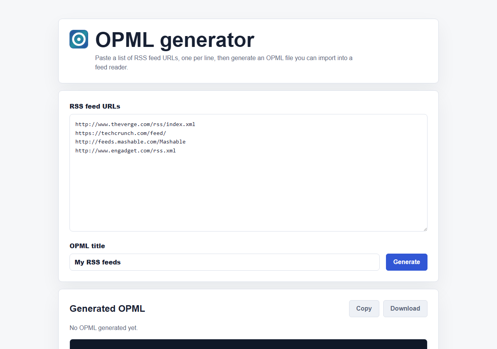

# OPML generator

Static rebuild of my old `opml-gen.ovh` website.  A lightweight web app that generates an OPML 2.0 file in your browser from a list of RSS feed URLs. 

  

**🔗 Live preview: [jmicaux.github.io/opml-gen](https://jmicaux.github.io/opml-gen/)**



If you enjoy this tool, you can support it:

[](https://buymeacoffee.com/jmicaux)

## Features

- **Paste and generate** — turn a list of RSS feed URLs into a valid OPML 2.0 file, entirely
  in the browser.
- **Fully static** — no build step, no server, no dependencies.

## Install & usage

Use it right away on the [live preview](https://jmicaux.github.io/opml-gen/) — nothing to
install. To run it locally, open `index.html` in a browser; no server is required.

## Project structure

```
opml-gen/
├── index.html   # page markup
├── styles.css   # page styles
├── app.js       # OPML generation logic
├── assets/      # opml-icon.png (recovered from the Internet Archive)
└── README.md
```

## License

Licensed under the [PolyForm Noncommercial License 1.0.0](LICENSE.md): you are free to fork,
modify and share this project **for noncommercial purposes**, as long as you keep the
attribution (`Required Notice: Copyright jmicaux`). Commercial use is not permitted.

## Credits

Built with the help of [Claude](https://claude.ai/code).
